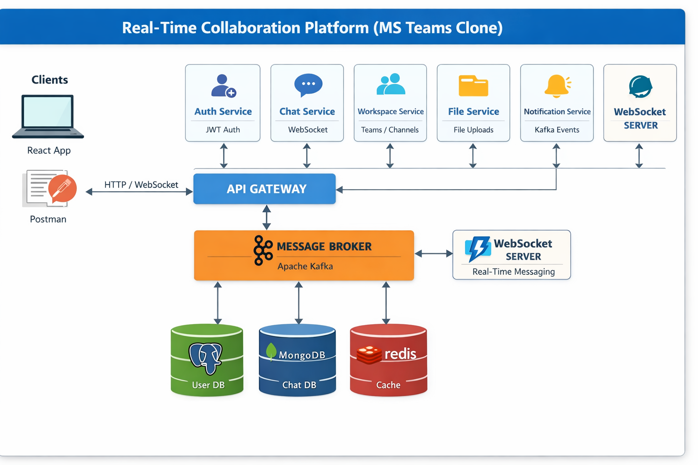
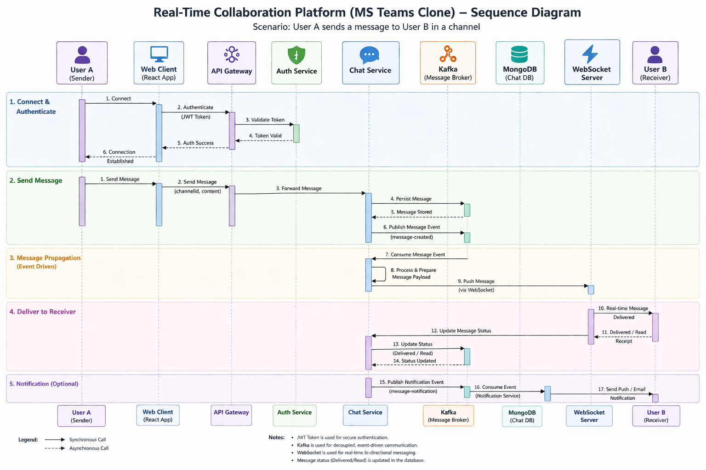

# Real-Time Collaboration Platform (MS Teams Backend Clone)

A scalable, production-grade backend system inspired by Microsoft Teams, Slack, and Discord.  
This project demonstrates real-time communication, distributed systems, and event-driven architecture using modern backend technologies.

---

## Overview

This project is a **real-time collaboration backend system** that supports:

- Instant messaging (1:1 and group chat)
- Real-time communication using WebSockets
- Workspaces & channels
- File sharing
- Notifications
- User authentication & authorization

It is designed using **microservices architecture** and follows **industry-level best practices**.

---

##  Objectives

- Build a **scalable backend system**
- Implement **real-time communication**
- Demonstrate **event-driven architecture**
- Apply **microservices design patterns**
- Showcase **production-ready backend skills**

---

##  System Architecture



```

            Client (React / Postman)
                    ↓
                API Gateway
                    ↓
 --------------------------------------------------
| Auth Service | Chat Service | Workspace Service  |
| File Service | Notification Service              |
 --------------------------------------------------
                    ↓

            Message Broker (Kafka)

                    ↓

              WebSocket Server

                    ↓

                Databases

```

## Sequence Diagram



---

##  Tech Stack

### Backend
- Java 17+
- Spring Boot
- Spring Security (JWT)
- Spring WebSocket

### Microservices
- Spring Cloud (Eureka, API Gateway)

### Messaging
- Apache Kafka (event-driven architecture)

### Database
- MongoDB (messages, chats)
- PostgreSQL (users, auth)

### Caching
- Redis

### DevOps
- Docker
- Docker Compose

---

##  Features

### Authentication Service
- User registration & login
- JWT-based authentication
- Role-based access (ADMIN, USER)

---

### Chat Service
- One-to-one messaging
- Group chats (channels)
- Message persistence
- Message states:
  - SENT
  - DELIVERED
  - READ

---

### Real-Time Communication
- WebSocket-based messaging
- Typing indicators
- Online/offline presence
- Instant message delivery

---

### Workspace Service
- Create workspaces (teams)
- Add/remove users
- Channel creation
- Role management

---

### File Service
- Upload/download files
- Attach files to messages
- Metadata storage

---

### Notification Service
- Event-driven notifications
- Email/push simulation
- Kafka-based triggers

---

## Event-Driven Flow

```

User sends message →
WebSocket →
Kafka Producer →
Chat Service →
Store in DB →
Kafka Consumer →
Push to receiver

```

---

## Project Structure

```

root/
│
├── api-gateway/
│   └── src/main/java/com/project/gateway/
│
├── auth-service/
│   ├── controller/
│   ├── service/
│   ├── repository/
│   ├── model/
│   ├── security/
│   └── config/
│
├── chat-service/
│   ├── controller/
│   ├── service/
│   ├── repository/
│   ├── model/
│   ├── websocket/
│   └── kafka/
│
├── workspace-service/
│   ├── controller/
│   ├── service/
│   ├── repository/
│   └── model/
│
├── notification-service/
│   ├── kafka/
│   ├── service/
│   └── listener/
│
├── file-service/
│   ├── controller/
│   ├── service/
│   └── storage/
│
├── common-lib/
│   ├── dto/
│   ├── utils/
│   └── constants/
│
├── docker-compose.yml
└── README.md

```

---

## Folder Explanation

- **controller/** → Handles API requests  
- **service/** → Business logic  
- **repository/** → Database operations  
- **model/** → Entity/Document classes  
- **websocket/** → Real-time communication  
- **kafka/** → Producer & consumer logic  
- **config/** → Security & configuration  

---

## Key Concepts Implemented

- Microservices Architecture  
- Event-Driven Systems (Kafka)  
- Real-Time Communication (WebSockets)  
- API Gateway Pattern  
- Service Discovery  
- Caching with Redis  
- Distributed Systems  

---

## Advanced Features

- Message pagination (infinite scroll)
- Search messages
- Rate limiting (anti-spam)
- Read receipts
- Typing indicators
- Presence tracking (online/offline)

---

## Bonus Features (Optional)

- Video call signaling (WebRTC backend)
- AI-based chat summarization
- End-to-end encryption (basic)

---

## 🧪 API Documentation

Swagger UI:  
http://localhost:8080/swagger-ui/

---

## Running the Project

### 1. Clone Repository
```

git clone [[https://github.com/your-username/teams-backend.git](https://github.com/Orion1163/teams_clone/)]([https://github.com/your-username/teams-backend.git](https://github.com/Orion1163/teams_clone/))
cd teams-backend

```

### 2. Run using Docker
```

docker-compose up --build

```

### 3. Access Services
- API Gateway → http://localhost:8080  
- Kafka → localhost:9092  
- MongoDB → localhost:27017  

---

##  Sample APIs

### Login
```

POST /auth/login

```

### Send Message
```

POST /chat/send

```

### Create Workspace
```

POST /workspace/create

```

---

## Database Design

### MongoDB
- messages  
- channels  
- workspaces  

### PostgreSQL
- users  
- roles  

---

## Scalability Considerations

- Stateless services for horizontal scaling  
- Kafka for decoupling services  
- Redis for caching frequently accessed data  
- Efficient database indexing  

---

## Future Improvements

- Kubernetes deployment  
- Distributed tracing (Zipkin)  
- Monitoring (Prometheus + Grafana)  
- CI/CD pipeline  

---

## Resume Description

Built a scalable real-time collaboration backend using Spring Boot, WebSockets, Kafka, and Redis, implementing microservices architecture, event-driven communication, and real-time messaging similar to Microsoft Teams.

---

## Author

Rohan Chaudhari

---

## ⭐ Final Note

This project demonstrates:
- System Design
- Scalability
- Real-time backend systems
- Production-level architecture

